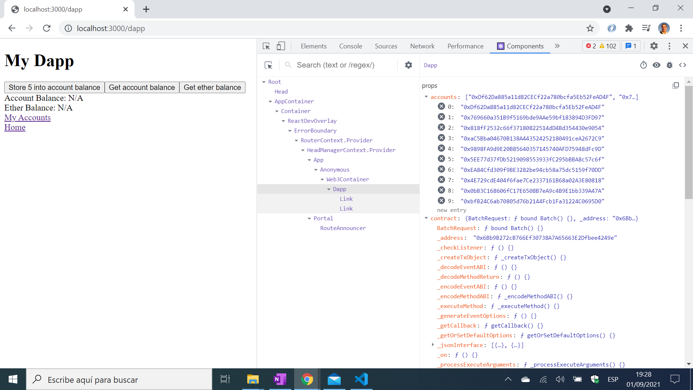

# Blockchain Ethereum Next

* Truffle Framework used to create an Ethereum app using Javascript and Solidity.
* Code from [Tony Pun](https://www.youtube.com/channel/UCBqJ3qgbyTxanJyZzflHvLQ) who uses a 'Truffle Box' boilerplate but this required some changes to work and to remove some errors - see [:clap: Inspiration](#clap-inspiration) below.
* **Note:** to open web links in a new window use: _ctrl+click on link_


## :page_facing_up: Table of contents

* [:zap: Blockchain Ethereum Next](#zap-blockchain-ethereum-next)
  * [:page_facing_up: Table of contents](#page_facing_up-table-of-contents)
  * [:books: General info](#books-general-info)
  * [:camera: Screenshots](#camera-screenshots)
  * [:signal_strength: Technologies](#signal_strength-technologies)
  * [:floppy_disk: Setup](#floppy_disk-setup)
  * [:flashlight: Testing](#flashlight-testing)
  * [:computer: Code Examples](#computer-code-examples)
  * [:cool: Features](#cool-features)
  * [:clipboard: Status & To-Do List](#clipboard-status--to-do-list)
  * [:clap: Inspiration](#clap-inspiration)
  * [:file_folder: License](#file_folder-license)
  * [:envelope: Contact](#envelope-contact)

## :books: General info

* Ethereum blockchain app is written in Solidity, similar to Javascript
* Truffle suite includes [Truffle Boxes](https://www.trufflesuite.com/boxes) with boiler-plate code. All are 3-4 years old so there can be issues with dependencies as well as old javascript code that works but causes errors.
* The app displays a very basic user interface that shows a list of 10 created accounts and allows some user interactions
* Google Chrome Extension Metamask used to connect with the app - custom network added to connect on `localhost:9545`
* client folder includes it's own readme

## :camera: Screenshots



## :signal_strength: Technologies

* [Truffle Suite](https://www.trufflesuite.com/) tools for smart contracts
* [Ethereum](https://ethereum.org/en/dapps/) decentralised app (DApps)
* [Solidity v0.8.6](https://docs.soliditylang.org/en/v0.8.6/) a curly-bracket language, object-oriented, high-level language for implementing smart contracts
* [Node.js v14](https://nodejs.org/en/) JavaScript runtime built on Chrome's V8 JavaScript engine.
* [MetaMask website](https://metamask.io/) & [MetaMask Chrome Extension](https://chrome.google.com/webstore/detail/metamask/nkbihfbeogaeaoehlefnkodbefgpgknn/related?hl=en) browser Ethereum wallet to use blockchain app
* [Next.js v11](https://nextjs.org/) frontend using React

## :floppy_disk: Setup

**Solidity code:**
* `truffle develop` to run Truffle dev console
* `compile` to compile app
* `migrate` to migrate app

**Frontend:**
* ``cd client`then `npm run dev` for a Next.js dev server, restarts on changes

**Metamask (if using)**
* add custom network to connect on `localhost:9545` (I called mine 'test' and used the same id)

## :flashlight: Testing

* from Truffle dev console: `test` to run 2 simple tests that pass

## :computer: Code Examples

* tba

```solidity

```

## :cool: Features

* connects with MetaMask Ethereum wallet Chrome Extension

## :clipboard: Status & To-Do List
* Status: Working
* To-Do: Nothing

## :clap: Inspiration

* [Tony Pun: Creating a Ethereum Solidity Dapp with Next.js 2021](https://www.youtube.com/watch?v=WPXvs9-krGs)
* [Truffle Suite: A MINIMAL SMART CONTRACT DEVELOPMENT BOILERPLATE](https://www.trufflesuite.com/boxes/truffle-next)

## :file_folder: License

* N/A

## :envelope: Contact

* Repo created by [ABateman](https://github.com/AndrewJBateman), email: gomezbateman@yahoo.com
